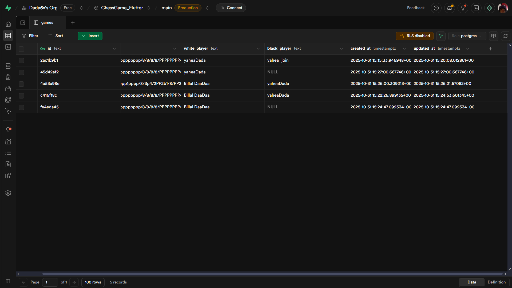

# Multiplayer Flutter Chess Game

A **real-time multiplayer chess game** built with **Flutter**, **Supabase**, and the **Bishop Chess Engine**, featuring smooth animations, elegant UI, and **real-time board synchronization using FEN**. Each player has a **distinct name**, displayed during online matches.

---

## 🚀 Overview


This project delivers a polished **cross-platform chess experience**, fast, scalable, and visually engaging.

### Key Features

* 🕹️ **Local Multiplayer** — Play with a friend on the same device
* 🌐 **Online Multiplayer** — Real-time sync powered by Supabase with **white and black player names displayed**
* 🤖 **Single-Player Mode** — Challenge an AI opponent
* ⚡ **Offline Support** — Continue playing without an internet connection
* 🎨 **Dynamic Theming** — Light and dark modes with smooth switching
* 🎉 **Win Confetti Animations**
* 🔊 **Move Sound Effects**
* 🌍 **Planned Full Localization** (English/Arabic)

---

## 🧹 Architecture Overview

The app is designed with a **modular, maintainable architecture** using **GetX** for state management and **Supabase** for real-time backend support.

### 🎗️ Project Structure

```
lib/
│
├── core/
│   ├── app/
│   │   ├── controller/       → Global app controller (theme, connection, localization)
│   │   ├── theme/            → Light and Dark theme configurations
│   │
│   ├── constants/            → App colors, utilities, helpers
│   ├── services/             → Supabase integration, caching, networking
│
├── presentation/
│   ├── features/
│   │   ├── game_menu/        → Main menu & navigation
│   │   ├── game_board/       → Board UI, move logic, animations
│   │   ├── single_player/    → AI gameplay
│   │   ├── multiplayer/      → Real-time FEN sync & player names
│   │   ├── settings/         → Theme, localization, preferences
│   │   ├── about_us/         → Developer info and links
│   │   └── options/          → Game options and modes
│   │
│   ├── widgets/              → Reusable components (buttons, dialogs)
│
└── main.dart                 → Entry point, Supabase setup, theme binding
```

---

## 🔗 Supabase Backend

Supabase powers **real-time multiplayer functionality** and ensures future scalability.



Features include:

* 🗄️ **PostgreSQL Database** — Game rooms, player names, move history
* ⚡ **Realtime API** — Instant FEN updates between players
* 🧱 **Storage** — Player profile pictures and match history

---

## ♻️ Real-Time Gameplay with FEN

### 🎯 What is FEN?

**FEN (Forsyth–Edwards Notation)** represents the complete chessboard state in a single line of text:

```
rnbqkbnr/pppppppp/8/8/8/8/PPPPPPPP/RNBQKBNR w KQkq - 0 1
```

It includes:

* Piece placement
* Active color
* Castling rights
* En passant target square
* Move counters

This allows **accurate, lightweight synchronization** between two players.

---

## ♜ Chess Board (ASCII Representation)

### Example FEN → ASCII

```
r n b q k b n r
p p p p p p p p
. . . . . . . .
. . . . . . . .
. . . . . . . .
. . . . . . . .
P P P P P P P P
R N B Q K B N R
```

| Piece  | Symbol |
| ------ | ------ |
| Pawn   | `p`    |
| Knight | `n`    |
| Bishop | `b`    |
| Rook   | `r`    |
| Queen  | `q`    |
| King   | `k`    |

| Flag | Meaning                   |
| ---- | ------------------------- |
| `n`  | Normal move               |
| `b`  | Big pawn move (2 squares) |
| `e`  | En passant capture        |
| `c`  | Capture                   |
| `k`  | Kingside castle           |
| `q`  | Queenside castle          |
| `p`  | Promotion                 |

---

## 🧠 Gameplay Modes

* **Local Multiplayer:** Play with a friend on the same device.
* **Online Multiplayer:** Play with others, with **white and black player names displayed in the game lobby and match table**.
* **AI Mode:** Challenge a bot with legal move generation:

```dart
withBot(goToSinglePlayer(bot: true));
```

---

## 🧭 Planned Features

| Status | Feature                            |
| :----: | ---------------------------------- |
|    ✅   | Online/offline detection           |
|    ✅   | Move sounds                        |
|    ✅   | Win/draw detection                 |
|    ✅   | QR code room joining               |
|   🕐   | Splash & loading screens           |
|   🕐   | User authentication                |
|   🕐   | Points system for unlocking themes |
|   🕐   | Spectator mode                     |
|   🕐   | Full localization (EN/AR)          |

---

## 🧱 Tech Stack

| Category          | Tool                             |
| ----------------- | -------------------------------- |
| Frontend          | Flutter                          |
| State Management  | GetX                             |
| Backend           | Supabase (Realtime + PostgreSQL) |
| Chess Logic       | Bishop Chess Engine              |
| Board Coordinates | Square package                   |
| Local Storage     | SharedPreferences                |
| Logging           | Logger                           |
| Responsive UI     | flutter_screenutil               |

---

## 🏁 Getting Started

### ⚡ Run Locally

```bash
git clone https://github.com/YahieaDada/chess_game.git
cd chess_game
flutter pub get
flutter run
```

---

## 👨‍💻 Developer


> *Built with Flutter, Supabase, Bishop Chess Engine, and a love for clean architecture and elegant UI.*
